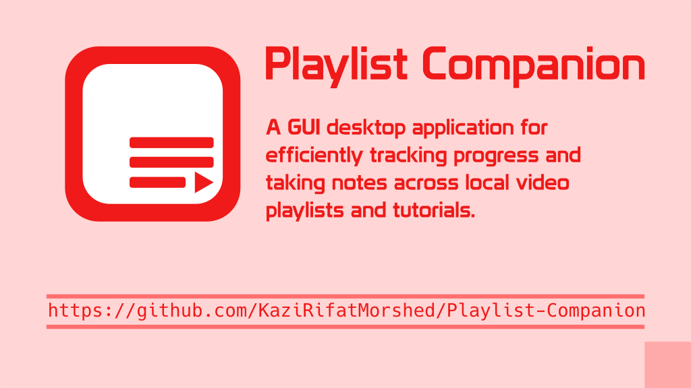

<div align="center">
  
</div>

<div align="center">

# PlaylistCompanion

**A desktop app to track your progress through local video playlists and tutorials**

[](https://github.com/noobcod3r-rtx/Playlist-Companion)
[](https://github.com/noobcod3r-rtx/Playlist-Companion/blob/main/LICENSE)
[](https://github.com/noobcod3r-rtx/Playlist-Companion)

</div>

Playlist Companion is a GUI desktop application built with C++ and the Qt6 framework that helps you track your progress through local video playlists and tutorials. It allows you to easily manage your video files, keep track of watched videos, and take notes to better organize your learning.

## ✨ Features

*   **Playlist Management:**
    *   Create, edit, and remove playlists effortlessly.
    *   **Auto-Import:** Add a folder, and the app automatically scans and imports all video files.
    *   **Sync:** Update existing playlists to include new videos added to the source folder.
*   **Progress Tracking:**
    *   **Watch Status:** Mark videos as watched or unwatched to keep track of your learning journey.
    *   **Navigation:** Quickly jump between videos with "Next" and "Previous" controls.
    *   **Visual Indicators:** Highlighting in the video table clearly shows your current progress.
*   **Detailed Analytics:**
    *   **Progress Bars:** Real-time visual representation of completion for each playlist.
    *   **Time Statistics:** Automatically calculates total watched time and remaining time in hours.
    *   **Completion Stats:** View the number of videos watched versus the total count at a glance.
*   **Integrated Note-Taking:**
    *   Write and save persistent notes for *every* video in your playlist.
    *   Notes are automatically saved and loaded as you navigate through your videos.
*   **Media Integration:**
    *   **External Player:** Launch your videos in your favorite external media player.
    *   **Configurable Settings:** Choose and set your preferred default media player.
    *   **Thumbnails:** Automatic thumbnail generation to help you visually identify your videos.
*   **Data Reliability:**
    *   **SQLite Backend:** All your data is safely stored in a local SQLite database.
    *   **Backup & Restore:** Built-in tools to create database backups and restore them whenever needed.
*   **Cross-Platform:**
    *   Native support for Windows, macOS, and Linux thanks to the Qt6 framework.

## 🚀 Getting Started

### Prerequisites

*   C++ Compiler (with C++17 support)
*   CMake (version 3.10 or higher)
*   Qt6

### Installation

To build the project, run the following commands from the root directory:

```bash
mkdir -p build
cd build
cmake ..
make
```

## 🏃‍♀️ Usage

After building the project, you can run the executable from the `build` directory:

```bash
./PlaylistCompanion
```

## 🤝 Contributing

Contributions are welcome! Please feel free to submit a pull request or open an issue.

1.  Fork the Project
2.  Create your Feature Branch (`git checkout -b feature/AmazingFeature`)
3.  Commit your Changes (`git commit -m 'Add some AmazingFeature'`)
4.  Push to the Branch (`git push origin feature/AmazingFeature`)
5.  Open a Pull Request

## 📜 License

This project is licensed under the MIT License - see the [LICENSE](LICENSE) file for details.

## 📂 Project Structure

*   `src/`: Contains the C++ source files.
*   `include/`: Contains the header files.
*   `build/`: Directory for build outputs. It is ignored by git.
*   `tests/`: Contains unit tests.
*   `CMakeLists.txt`: The build script for CMake.
